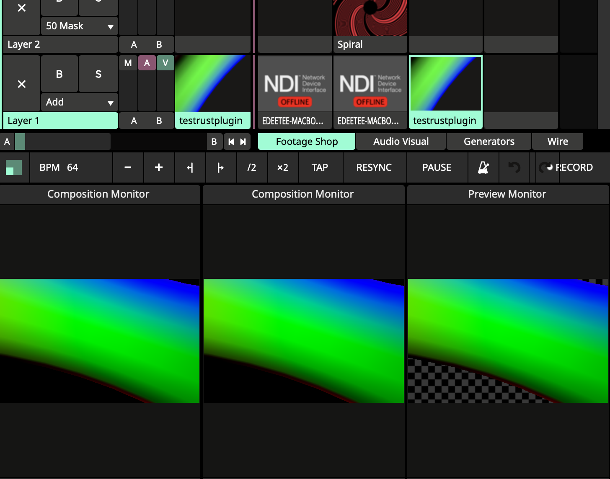

# Minimal shader graph

A node graph renderer written in rust utilising [egui_node_graph](https://github.com/setzer22/egui_node_graph) for the graph view.

I am developing this for the use case of live generative visual performances, where I want to do performant, intuitive experimentation without crashes.

## Features

- _!!NEW!!_ FFGL Shader output
  - Run your graph inside resolume
- ISF shader support
  - Hot reloading
  - Default ISF location (install the [Isf Editor](https://isf.vidvox.net/desktop-editor/) for a free library of examples)
- Obj file render
  - Will cull objects if they have many vertices (WIP)
- GL Expression OP
  - Boilerplate removal
- Save state
  - Auto save on exit
  - Diff friendly json
- Show errors in UI

## Inspirations

https://github.com/dfranx/SHADERed

https://derivative.ca/

## Contributing

API is very much unstable at the moment. Even so, it is already quite powerful and I would love support to get this polished up. If you are interested in contributing, please get in contact with me at edeetee@gmail.com

## Next

- FFGL Inputs
- Vector math node
- Parameter sharing
  - FFGL
  - OSCQuery
- Multiple save files
- Full ISF spec
- SDF Nodes

---

## Testing Resolume

`cargo watch -s ./run_resolume.sh`

## Backlog

- Remote control
  - Edit graph of a remote instance
- Spout/Syphon (GPU Texture sharing)
- Shadertoy emulator
- Make systems to define easy way to have common types across nodes so that it works nicely with rust Into<T> system and makes it easy to use graph features/types modularly and simply.
- Transparent windows https://ecode.dev/transparent-framebuffer-borderless-window-using-glfw/
- Only use Srgb textures for visible nodes
- Extend egui_node_graph for zooming etc
- Dependency resolution ala touchdesigner (only cook what is required)
- Hot reloading rust code
- Bevy / rend3 integration
- Midi control UI
- ISF Meta ops (more complex interface for handling racks + isf standard effects/transitions)
- Continue reducing dependencies between structs
- Support different texture sizes (options per node)
- Sub shader input for obj render
- Parameter template system for nodes
  - ISF transitions/effects
  - consistent midi controls
  - easy way to map simple control systems to complex operators / groups of operators
  - Better than CHOPs
- Temporal reprojection for low fps
- Ability to use different runtimes (bevy, VSTs)
